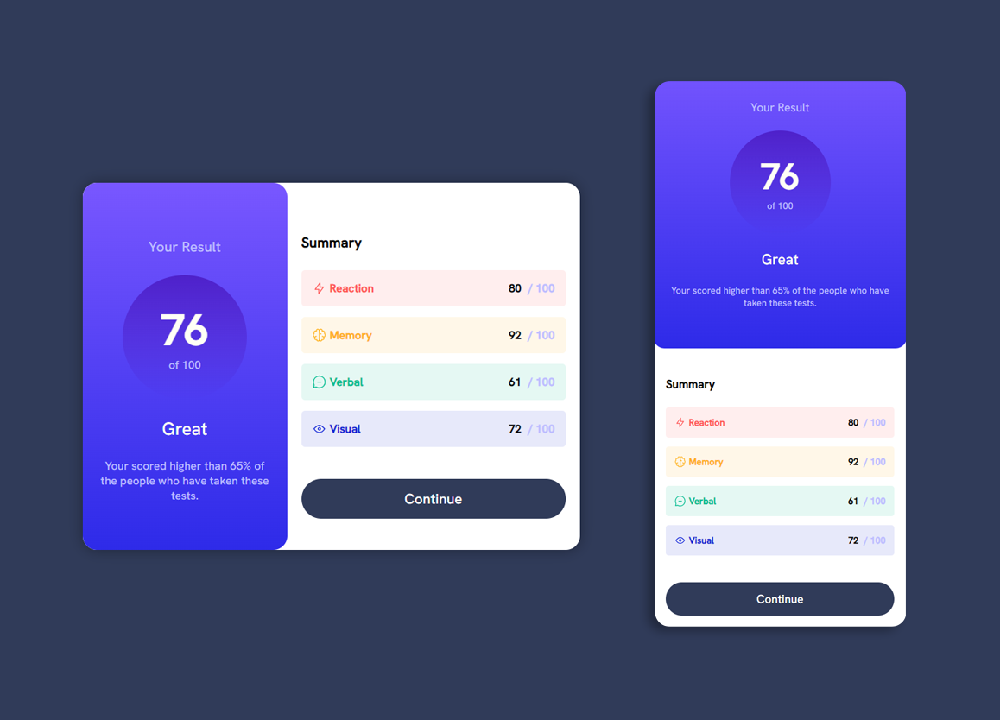

    <h1 style="color:cyan">Hello All</h1>
     
    

    - This repository is dedicated to projects built with HTML and CSS, focusing on clean and simple design;
    

    <ul style="border:1px solid white;border-radius:20px;padding-top:20px;padding-bottom:20px">
        
Through these projects, I learned :

        <li style="margin-top:10px">
            Responsive Design
        </li>
        <li>   
            How to use HTML and CSS to create simple and clean web pages
        </li>
        <li>
            Improving the look and feel of web pages
        </li>
    </ul>
    

        - این ریپازیتوری به پروژه هایی اختصاص دارد که با HTML و CSS ساخته شده اند و بر طراحی ساده و تمیز تمرکز دارند.
    

    <ul dir="rtl" style="border:1px solid white;border-radius:20px;padding-top:20px;padding-bottom:20px">
        
جیز هایی که در این پروژه یاد گرفتم:

        <li style="margin-top:10px">طراحی منعطف</li>
        <li>طریقه درست استفاده از HTML CSS برای ایجاد صفحه های تمیز و ساده وب</li>
        <li>بهبود طراحی ظاهر صفحه های وب</li>
    </ul>   
    

        

            
اطلاعات پروژه - project info

        

        

            
            <h2>Result Summary Component Project</h2>
            

                Languages : HTML | CSS 
            

        

        

    

